# Roadmap del Proyecto Bibu - App de Rutinas con Mascota Virtual

> **Bibu - Tu rutina con vida** | Routine tracker with evolving pet companion

---

## Estado Actual del Proyecto

### Arquitectura General

```mermaid
flowchart TB
    subgraph Core["Core"]
        main["lib/main.dart"]
        app["lib/app.dart"]
        router["lib/core/routing/app_router.dart"]
        theme["lib/core/theme/"]
        data["lib/core/data/hive_adapters.dart"]
        utils["lib/core/utils/extensions.dart"]
    end

    subgraph Features["Features"]
        auth["auth/"]
        pet["pet/"]
        routine["routine/"]
        stats["stats/"]
        settings["settings/"]
        onboarding["onboarding/"]
    end

    subgraph Shared["Shared"]
        bottomNav["shared/widgets/app_bottom_nav.dart"]
        animatedIcon["shared/widgets/animated_app_icon.dart"]
    end

    main --> app
    app --> router
    router --> auth
    router --> routine
    router --> pet
    router --> stats
    router --> settings
    router --> onboarding

    routine <--> pet
    auth --> settings
    stats --> routine
    settings --> theme
```

### Stack Tecnológico Actual

| Categoría | Tecnología | Estado |
|-----------|-----------|--------|
| Framework | Flutter 3.9.2+ | ✅ Implementado |
| State Management | Riverpod + code generation | ✅ Implementado |
| Routing | go_router 14.8.1 | ✅ Implementado |
| Local Storage | hive_flutter 1.1.0 | ✅ Implementado |
| Animations | flutter_animate 4.5.2 + lottie 3.3.1 | ✅ Implementado |
| Fonts | google_fonts 6.2.1 (Nunito) | ✅ Implementado |
| Auth | SharedPreferences (mock) | ⚠️ Parcial |
| Notifications | - | ❌ No implementado |
| Backend/API | - | ❌ No implementado |

---

## Módulo 1: Autenticación (`lib/features/auth/`)

### Estado Actual

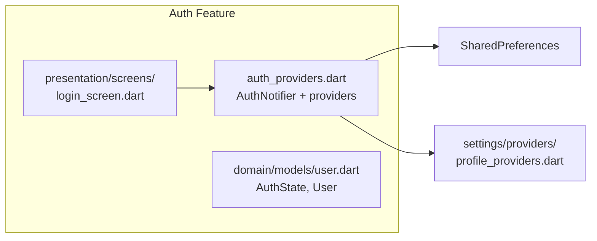

### Lo que tiene ✅
- `AuthState` con estados: `unauthenticated`, `loading`, `authenticated`
- `User` model con id, name, email, photoUrl
- `AuthNotifier` con login/logout (mock)
- Login screen con email/password + Google/Apple buttons
- Sync con profile providers

### Mejoras Posibles 🔧

#### 1.1 Autenticación Real con Firebase
```
Opciones:
├── Firebase Auth (recomendado)
│   ├── Google Sign-In
│   ├── Apple Sign-In
│   ├── Email/Password
│   └── OAuth providers
├── Supabase Auth
│   ├── Similar features
│   └── Built-in Realtime
└── AWS Cognito
```

#### 1.2 Feature: Social Login Completo
```dart
// providers/auth_providers.dart - Mejora
class SocialAuthProvider {
  Future<User?> signInWithGoogle();
  Future<User?> signInWithApple();
  Future<void> signOut();
  Stream<User?> authStateChanges();
}
```

#### 1.3 Feature: Registro de Usuario
```dart
// domain/models/user.dart - Extender
class User {
  final String id;
  final String name;
  final String email;
  final String? photoUrl;
  final DateTime createdAt;
  final UserPreferences preferences;
  final List<String> ownedPets; // múltiples mascotas
}

class UserPreferences {
  final String theme;
  final String language;
  final bool notificationsEnabled;
  final List<int> favoriteCategories;
}
```

#### 1.4 Feature: Perfil de Usuario Extendido
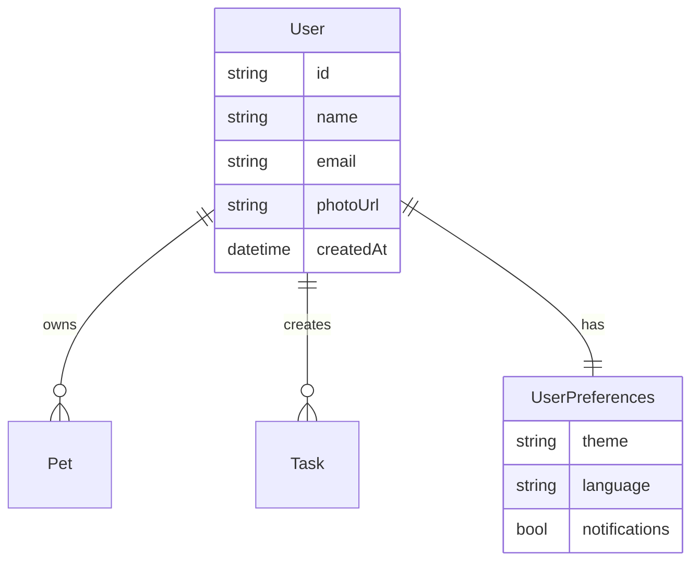

---

## Módulo 2: Mascota Virtual (`lib/features/pet/`)

### Estado Actual

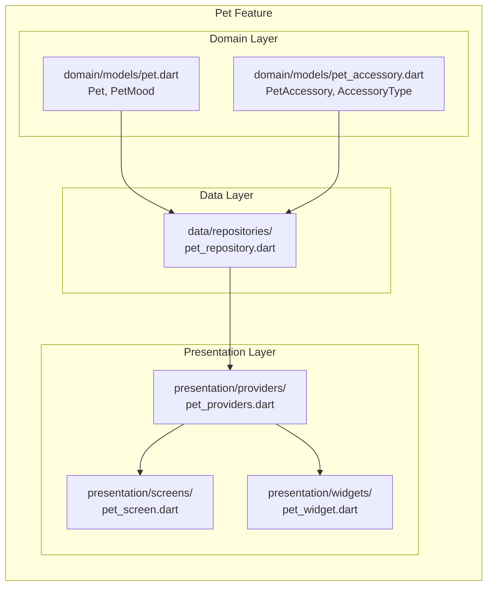

### Lo que tiene ✅
- `Pet` model con XP, coins, level, mood
- Sistema de nivelación: 0-2→🐣, 3-4→🐰, 5-9→🐱, 10-14→🐉, 15+→🦄
- 9 accesorios predefinidos (hats, glasses, backgrounds, effects)
- Tienda de accesorios funcional
- Repositorio Hive
- Animaciones de estado de ánimo

### Mejoras Posibles 🔧

#### 2.1 Sistema de Mascotas Múltiples

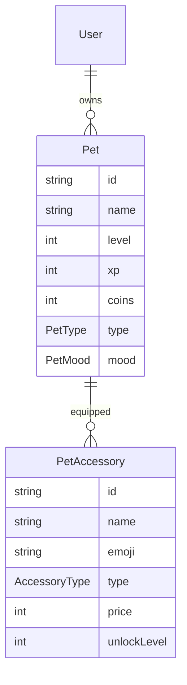

```dart
// Domain: Extender modelo
class Pet {
  final PetType type; // egg, baby, teen, adult
  final String birthDate;
  final int happiness;
  final int hunger;
  final PetState state; // happy, neutral, sad, sick
}

enum PetType { chick, bunny, cat, dragon, unicorn, phoenix }

// Nuevos repositorios
class PetRepositoryV2 {
  Future<List<Pet>> getAllPets();
  Future<Pet?> getActivePet();
  Future<void> setActivePet(String petId);
  Future<Pet> hatchNewPet(EggType egg);
  Future<void> feedPet(String petId, FoodType food);
  Future<void> playWithPet(String petId);
}
```

#### 2.2 Sistema de Estados de Ánimo Mejorado

```dart
class PetMoodSystem {
  // Variables que afectan el mood
  int happiness;      // 0-100, afecta animación
  int hunger;         // 0-100, baja con el tiempo
  int energy;         // 0-100, se usa haciendo tareas
  int social;         // 0-100, basado en interacciones

  // Descuentos por inactividad
  static const hungerDecayPerHour = 5;
  static const happinessDecayPerDay = 10;

  // Recover actions
  void feed(FoodType food);    // +20 hunger
  void play(MiniGame game);    // +15 happiness, -10 energy
  void sleep();                // +50 energy, pasa tiempo
}
```

#### 2.3 Tiendas y Transacciones

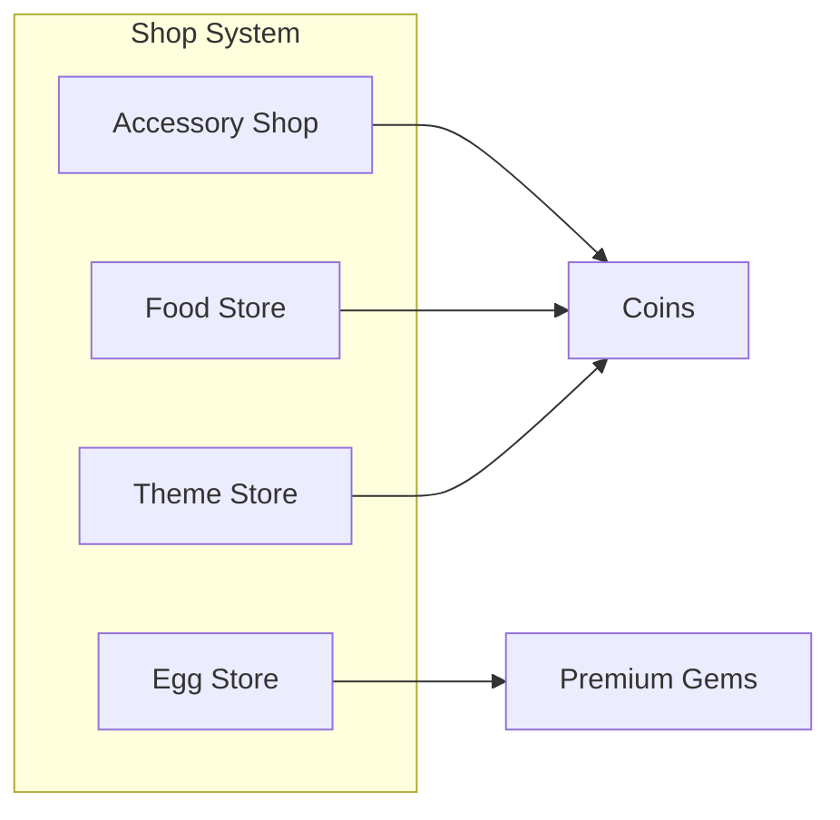

```dart
// Nuevos items
class FoodItem {
  final String id;
  final String name;
  final String emoji;
  final FoodType type;
  final int price;
  final int hungerRestore;
  final int happinessRestore;
  final int energyRestore;
}

class ThemeItem {
  final String id;
  final String name;
  final String previewImage;
  final int price;
  final bool isPremium;
  final List<Color> colors;
}

class EggItem {
  final String id;
  final String name;
  final Rarity rarity; // common, rare, epic, legendary
  final int price;
  final HatchTime hatchTime;
  final List<PetType> possiblePets;
}
```

#### 2.4 Mini-Juegos

```
┌─────────────────────────────────────────────────────────┐
│                    Mini-Games Hub                        │
├─────────────┬─────────────┬─────────────┬───────────────┤
│   🎯 Quiz   │  🧩 Puzzle  │  🎮 Memory  │   ⏱️ Timed    │
│  Routine   │   Match 3   │   Card      │   Challenge   │
│  Questions │             │   Game      │               │
├─────────────┼─────────────┼─────────────┼───────────────┤
│  +10 XP     │  +15 XP     │  +10 XP     │  +20 XP       │
│  +5 Coins   │  +10 Coins  │  +5 Coins   │  +15 Coins    │
│  Uses energy│ Uses energy │ Uses energy │ Uses energy   │
└─────────────┴─────────────┴─────────────┴───────────────┘
```

```dart
abstract class MiniGame {
  String get name;
  String get description;
  String get icon;
  int get xpReward;
  int get coinReward;
  int get energyCost;
  Duration get estimatedTime;

  Future<GameResult> play();
  bool isUnlocked(UserProgress progress);
}

class QuizGame implements MiniGame {
  final List<QuizQuestion> questions;
  final int questionsPerRound = 5;
  // Preguntas sobre hábitos, productividad, etc.
}

class MemoryGame implements MiniGame {
  final int gridSize; // 4x3, 4x4, 6x4
  final Duration timeLimit;
  // Emparejar pares de iconos
}
```

#### 2.5 Evolución Visual de Mascota

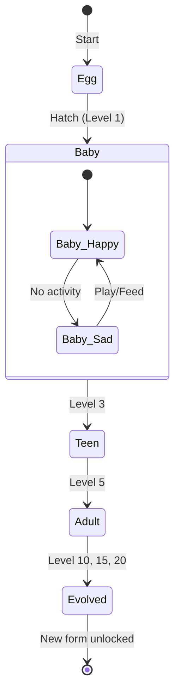

---

## Módulo 3: Rutinas/Tareas (`lib/features/routine/`)

### Estado Actual

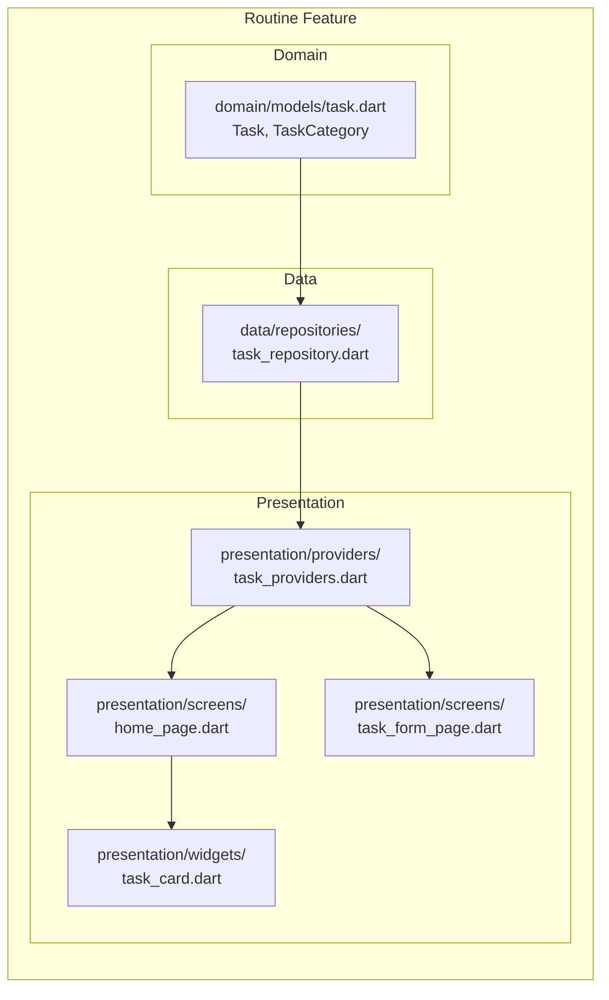

### Lo que tiene ✅
- Modelo `Task` completo con 6 categorías
- Sistema de recompensas XP/Coins por tarea
- Repositorio Hive con CRUD
- Formulario de creación/edición
- Lista de tareas para hoy
- Toggle de completado

### Mejoras Posibles 🔧

#### 3.1 Sistema de Hábitos/Horarios

```mermaid
erDiagram
    Task ||--o{ Schedule : "has"
    Task ||--o{ Reminder : "triggers"
    Task ||--o{ Habit : "becomes"
    Schedule {
        string id
        TaskID taskId
        repeated DayOfWeek days
        TimeOfDay time
        RecurrenceType recurrence
    }
    Habit {
        int currentStreak
        int bestStreak
        int totalCompletions
        float completionRate
        datetime lastCompleted
    }
```

```dart
// Enhanced Task Model
class Task {
  // ... existing fields ...
  final Schedule? schedule;
  final List<Reminder>? reminders;
  final Habit? habitData;
  final Difficulty difficulty; // easy, medium, hard
  final List<String> subtasks;
  final String? location;
  final List<String> tags;
}

enum RecurrenceType { daily, weekly, monthly, custom }
enum Difficulty { easy, medium, hard }

class Habit {
  final int currentStreak;
  final int bestStreak;
  final int totalCompletions;
  final DateTime? lastCompletedDate;
  final List<int> weeklyHistory; // last 12 weeks
}
```

#### 3.2 Notificaciones y Recordatorios

```dart
class NotificationService {
  Future<void> scheduleTaskReminder({
    required Task task,
    required DateTime scheduledTime,
    String? customMessage,
  });

  Future<void> scheduleHabitReminder({
    required Habit habit,
    required List<DayOfWeek> days,
    required TimeOfDay time,
  });

  Future<void> schedulePetNeedsReminder({
    required Pet pet,
    Duration after,
  });

  // Tipos de notificación
  // - "Es hora de: {task.title}"
  // - "Tu mascota {pet.name} tiene hambre 🐱"
  // - "¡No olvides tu racha de {streak} días!"
  // - "¡{pet.name} evolved! 🐣 → 🐰"
}
```

#### 3.3 Widgets de Fecha y Calendario

```
┌─────────────────────────────────────────────────────────┐
│  < Mayo 2026 >                                          │
├─────────────────────────────────────────────────────────┤
│   Lun   Mar   Mié   Jue   Vie   Sáb   Dom               │
│    27    28    29    30     1     2     3                │
│   [●]   [●]   [○]   [●]   [●]   [ ]   [ ]              │
│    28    29    30    31     1     2     3                │
│   [●]   [●]   [●]   [●]   [ ]   [ ]   [ ]              │
│                         ^                               │
│                    Hoy (60%)                            │
└─────────────────────────────────────────────────────────┘
```

```dart
class CalendarView extends StatelessWidget {
  final DateTime selectedMonth;
  final Map<DateTime, DayCompletionStatus> completionData;
  final void Function(DateTime) onDaySelected;

  Color getCompletionColor(double rate); // 0-33% red, 34-66% yellow, 67-100% green
}
```

#### 3.4 Análisis de Productividad

```mermaid
flowchart LR
    subgraph Analysis["Productivity Analysis"]
        heatmap["Heat Map\n(actividad por hora/día)"]
        graph["Weekly Graph\n(tareas completadas)"]
        compare["Compare\n(semanas anteriores)"]
        insights["AI Insights\n(recomendaciones)"]
    end

    heatmap --> insights
    graph --> insights
    compare --> insights
```

```dart
class ProductivityInsights {
  final String insight;
  final InsightType type; // achievement, warning, suggestion
  final int? relatedTaskCount;
  final List<String> suggestedActions;

  // Ejemplos:
  // "Mejor momento para tareas difíciles: 9 AM"
  // "Tienes 80% más tareas los lunes"
  // "Tu productividad baja los viernes por la tarde"
  // "Considera dividir '{task}' en tareas más pequeñas"
}
```

#### 3.5 Sub-tareas y Pasos

```dart
class Subtask {
  final String id;
  final String title;
  final bool isCompleted;
  final int order;

  // UI:
  // ☑ Lavar ropa
  //   ├☑ Clasificar colores
  //   ├☑ Agregar detergente
  //   └☐ Iniciar lavadora
}
```

---

## Módulo 4: Estadísticas (`lib/features/stats/`)

### Estado Actual

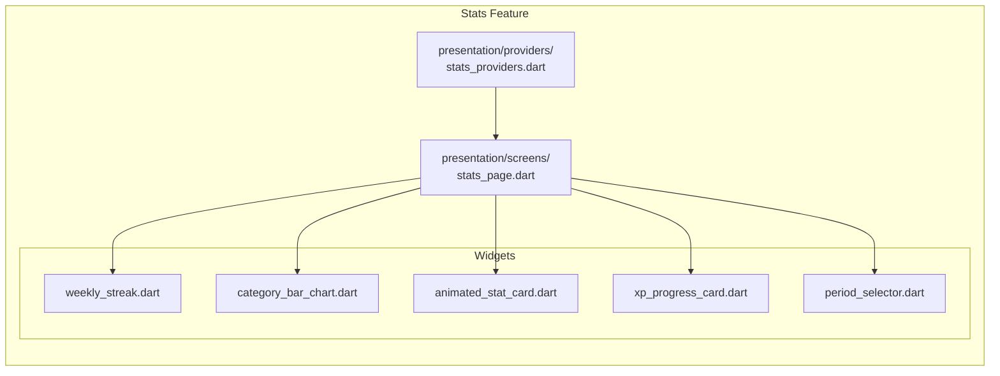

### Lo que tiene ✅
- Period selector (week/month/allTime)
- 4 stat cards: completed tasks, XP earned, coins earned, current streak
- Category bar chart
- Weekly streak visualization
- XP progress card linking to pet screen

### Mejoras Posibles 🔧

#### 4.1 Dashboard Analytics Avanzado

```
┌─────────────────────────────────────────────────────────────┐
│                    📊 Analytics Dashboard                     │
├─────────────────────────────────────────────────────────────┤
│                                                             │
│  ┌──────────────┐  ┌──────────────┐  ┌──────────────┐     │
│  │   📈 Trend   │  │  🎯 Goals    │  │  🏆 Achievements│     │
│  │   Analysis   │  │  Progress    │  │   Unlocked    │     │
│  └──────────────┘  └──────────────┘  └──────────────┘     │
│                                                             │
│  ┌─────────────────────────────────────────────────────┐   │
│  │              📅 Activity Calendar                    │   │
│  │   (GitHub-style contribution graph)                 │   │
│  └─────────────────────────────────────────────────────┘   │
│                                                             │
│  ┌─────────────────────────────────────────────────────┐   │
│  │           📊 Category Distribution                   │   │
│  │    (Pie/Donut chart con animaciones)               │   │
│  └─────────────────────────────────────────────────────┘   │
│                                                             │
└─────────────────────────────────────────────────────────────┘
```

#### 4.2 Sistema de Logros/Achievements

```dart
class Achievement {
  final String id;
  final String name;
  final String description;
  final String icon;
  final int xpReward;
  final AchievementType type;
  final int targetValue;
  final DateTime? unlockedAt;

  bool isUnlocked(UserProgress progress);
}

enum AchievementType {
  streak,      // "7 días seguidos"
  completion,  // "100 tareas completadas"
  category,    // "Completa 50 tareas de salud"
  social,      // "Comparte tu progreso"
  special,     // "Desbloquea todas las mascotas"
}

// Ejemplos de logros
class Achievements {
  static const firstTask = Achievement(
    id: 'first_task',
    name: '¡Comenzar!',
    description: 'Completa tu primera tarea',
    icon: '🎯',
    xpReward: 10,
    type: AchievementType.completion,
    targetValue: 1,
  );

  static const weekStreak = Achievement(
    id: 'week_streak',
    name: 'Semana Perfecta',
    description: '7 días consecutivos',
    icon: '🔥',
    xpReward: 50,
    type: AchievementType.streak,
    targetValue: 7,
  );

  static const centurion = Achievement(
    id: 'centurion',
    name: 'Centurión',
    description: '100 tareas completadas',
    icon: '💯',
    xpReward: 100,
    type: AchievementType.completion,
    targetValue: 100,
  );
}
```

#### 4.3 Gráficos Avanzados

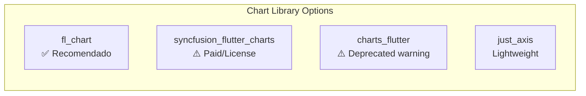

```dart
// Gráfico de barras por categoría
class CategoryBarChart {
  // Ya existe - mejorar con:
  // - Tooltips al tocar
  // - Animación de entrada secuencial
  // - Leyenda interactiva
  // - Modo comparativo (semana actual vs anterior)
}

// Gráfico de dona para distribución
class CategoryDonutChart {
  final List<CategoryData> data;
  final bool showPercentage;
  final bool showLegend;

  // Animación de rotación al aparecer
  // Touch para expandir sección
}

// Gráfico de línea para tendencias
class TrendLineChart {
  final List<TrendPoint> points;
  final String title;
  final bool showArea;
  final bool showDots;

  // Zoom y pan
  // Tooltip con valor exacto
}

// Heatmap calendar
class ActivityHeatmap {
  final Map<DateTime, int> data; // Date -> completion count
  final ColorScheme colorScheme;

  // GitHub-style: 5 niveles de intensidad
  // Tooltip con detalles al tocar
}
```

#### 4.4 Goals/Objetivos

```dart
class Goal {
  final String id;
  final String title;
  final String description;
  final GoalType type;
  final int targetValue;
  final int currentValue;
  final DateTime createdAt;
  final DateTime? deadline;
  final GoalReward reward;

  double get progress => currentValue / targetValue;
  bool get isCompleted => currentValue >= targetValue;
}

enum GoalType {
  dailyTasks,     // "Completa 5 tareas hoy"
  weeklyStreak,    // "Mantén racha de 7 días"
  categoryMaster,  // "50 tareas de salud"
  xpCollector,     // "Acumula 1000 XP"
  petLevel,        // "Nivel 10 con tu mascota"
}

class GoalReward {
  final int xp;
  final int coins;
  final String? accessoryId;
  final String? achievementId;
}
```

---

## Módulo 5: Settings (`lib/features/settings/`)

### Estado Actual
- Dark mode toggle (persisted)
- Profile editing (name, email, photo)
- Placeholder sections for notifications/language
- Privacy, security, terms links
- Logout

### Mejoras Posibles 🔧

#### 5.1 Configuración Completa

```dart
class AppSettings {
  final ThemeMode themeMode;
  final String language;
  final NotificationSettings notifications;
  final PrivacySettings privacy;
  final AccessibilitySettings accessibility;
}

class NotificationSettings {
  final bool enabled;
  final bool taskReminders;
  final bool petNeeds;
  final bool achievements;
  final bool weeklyReport;
  final TimeOfDay quietHoursStart;
  final TimeOfDay quietHoursEnd;
  final List<DayOfWeek> reminderDays;
  final List<TimeOfDay> reminderTimes;
}

class AccessibilitySettings {
  final double textScale;
  final bool highContrast;
  final bool reduceMotion;
  final String colorblindMode; // none, deuteranopia, protanopia
  final bool hapticFeedback;
}
```

#### 5.2 Preferencias de Comunidad

```
┌─────────────────────────────────────────────────────────┐
│                 🌍 Community Preferences                 │
├─────────────────────────────────────────────────────────┤
│                                                         │
│  Language    [Español ▼]                               │
│  ─────────────────────────────────────────────────     │
│  Region      [México ▼]                                 │
│  Currency    [MXN $ ▼]                                  │
│  Units       [Metric ▼]                                │
│  Date Format [DD/MM/YYYY ▼]                            │
│                                                         │
└─────────────────────────────────────────────────────────┘
```

---

## Módulo 6: Onboarding (`lib/features/onboarding/`)

### Estado Actual
- Splash screen con Lottie
- 3-page onboarding con ilustraciones
- Navegación a login/home

### Mejoras Posibles 🔧

#### 6.1 Onboarding Interactivo Mejorado

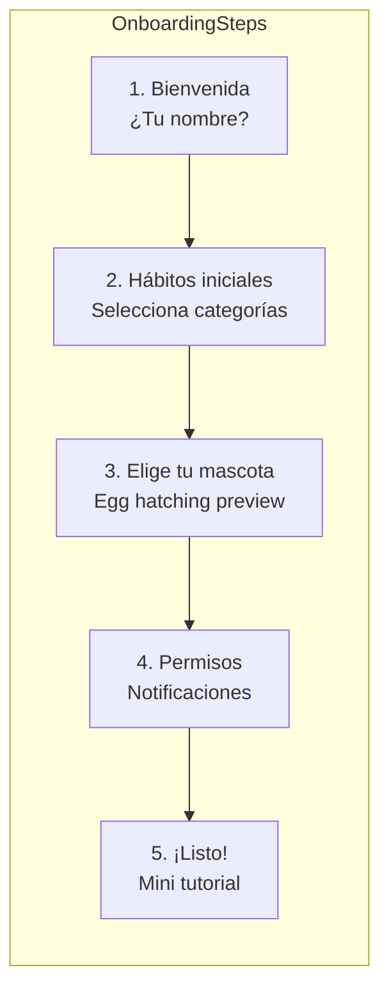

#### 6.2 Tutorial Interactivo

```dart
class InteractiveTutorial {
  final List<TutorialStep> steps;

  // Ejemplo de pasos:
  // 1. "Toca la tarea para completarla" → Highlight task card
  // 2. "Mira cómo crece tu mascota" → Highlight pet widget
  // 3. "Explora los accesorios" → Highlight shop button
  // 4. "Revisa tu progreso" → Highlight stats tab
}

class TutorialStep {
  final String title;
  final String description;
  final String highlightWidget;
  final TutorialArrowDirection arrowDirection;
  final Offset? customPosition;
}
```

---

## Módulo 7: Shared/UI Components (`lib/shared/widgets/`)

### Estado Actual
- `AppBottomNav`: Custom bottom navigation con FAB
- `AnimatedAppIcon`: Iconos animados (pop/pulse/float)

### Mejoras Posibles 🔧

#### 7.1 Design System

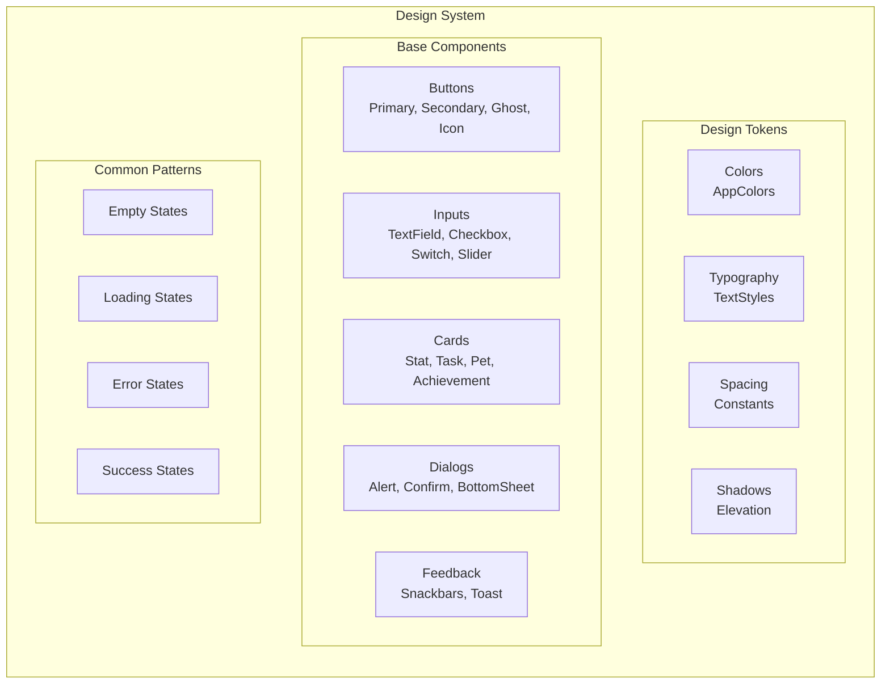

#### 7.2 Componentes Pendientes

```dart
// Empty States
class EmptyStateWidget {
  final String title;
  final String description;
  final String? illustration; // Lottie o emoji
  final String? actionLabel;
  final VoidCallback? onAction;

  // Estados:
  // - No tasks: "¡Sin tareas! Agrega tu primera rutina"
  // - No pets: "Tu mascota murió 💀... ¿otra oportunidad?"
  // - No stats: "Completa tareas para ver estadísticas"
  // - No achievements: "Desbloquea logros completando tareas"
}

// Loading States
class ShimmerLoading {
  // Skeleton screens para:
  // - Task list
  // - Pet screen
  // - Stats dashboard
  // - Profile page
}

// Error States
class ErrorStateWidget {
  final String title;
  final String message;
  final String? icon;
  final String retryLabel;
  final VoidCallback onRetry;
}
```

---

## Módulo 8: Backend/Sincronización (No implementado)

### Mejoras Posibles 🔧

#### 8.1 Arquitectura Backend Sugerida

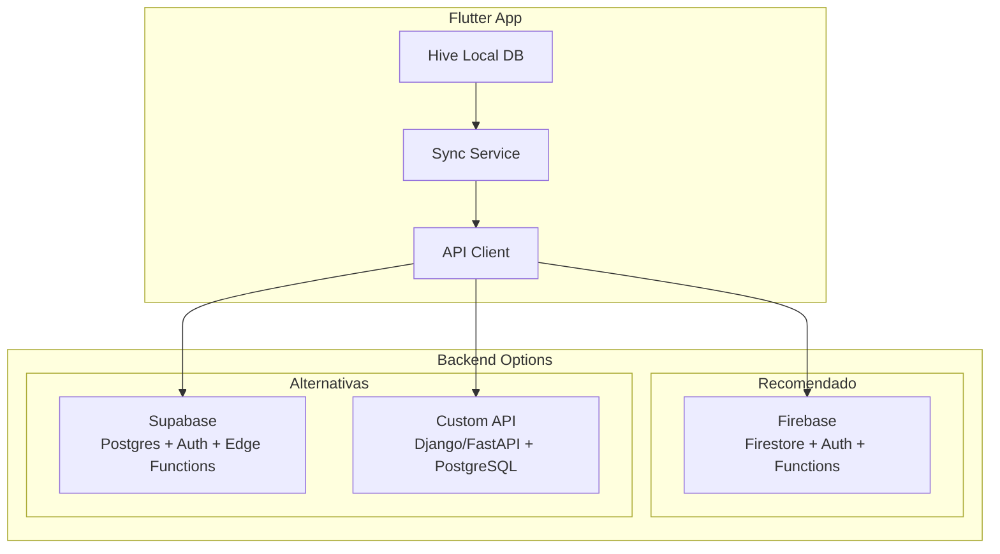

#### 8.2 Modelos de Datos para Backend

```dart
// Cloud Firestore Structure
class FirestoreCollections {
  static const users = 'users';
  static const pets = 'pets';
  static const tasks = 'tasks';
  static const achievements = 'achievements';
  static const settings = 'settings';
}

// User document
class UserDoc {
  final String id;
  final String name;
  final String email;
  final String? photoUrl;
  final DateTime createdAt;
  final UserStats stats;
  final List<String> ownedPetIds;
  final List<String> unlockedAccessoryIds;
}

// Task document con timestamps
class TaskDoc {
  final String id;
  final String userId;
  final String title;
  final String? description;
  final String category;
  final DateTime? scheduledTime;
  final List<int> repeatDays;
  final bool isCompleted;
  final DateTime createdAt;
  final DateTime? completedAt;
  final int xpReward;
  final int coinReward;
}
```

#### 8.3 Sync Strategy

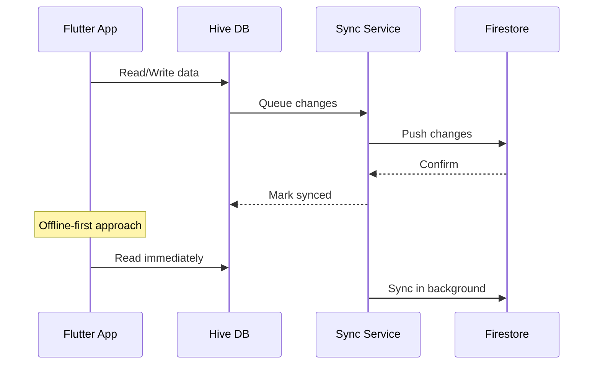

#### 8.4 Conflict Resolution

```dart
class SyncConflict {
  final String field;
  final dynamic localValue;
  final dynamic remoteValue;
  final DateTime localTimestamp;
  final DateTime remoteTimestamp;

  ResolutionStrategy resolve() {
    // Strategies:
    // - Last write wins (default)
    // - Server wins (for shared data)
    // - Client wins (for user preferences)
    // - Merge (for arrays)
    // - Manual (notify user)
  }
}
```

---

## Módulo 9: Features Futuras

#### 9.1 Sistema de Moneda Premium

```mermaid
flowchart LR
    subgraph CurrencySystem
        direction TB

        subgraph Coins["Moneda Regular"]
            earn["Earn Coins"]
            spend["Spend Coins"]
            coins_source["Tareas", "Streaks", "Mini-games"]
            coins_use["Accesorios", "Comida", "Temas"]
        end

        subgraph Gems["Moneda Premium"]
            buy["Buy Gems"]
            gems_source["IAP", "Achievements"]
            gems_use["Eggs raros", "Temas premium", "Boosters"]
        end
    end
```

#### 9.2 Sistema Social/Compartisión

```dart
class SocialFeatures {
  // Opciones futuras:
  // - Compartir logros
  // - Amistades
  // - Competencias semanales
  // - Leaderboards
  // - Pets de amigos en tu mundo
}
```

#### 9.3 Widgets de Home Screen

```
┌─────────────────────┐
│  Rutina de Hoy      │
│  ┌────┬────┬────┐  │
│  │ 🏃│ 💊│ 📚│  │
│  │ 3 │ 2 │ 1 │  │
│  └────┴────┴────┘  │
│                     │
│  🐱 Mimí Nivel 8    │
│  ████████░░ 80%     │
│                     │
│  🔥 Racha: 5 días   │
└─────────────────────┘
```

#### 9.4 Apple Watch / Wear OS

```dart
class WearIntegration {
  // Notificaciones adaptadas
  // Quick task completion desde watch
  // Pet health visible en watch face
  // Complications para racha/XP
}
```

---

## Resumen de Prioridades

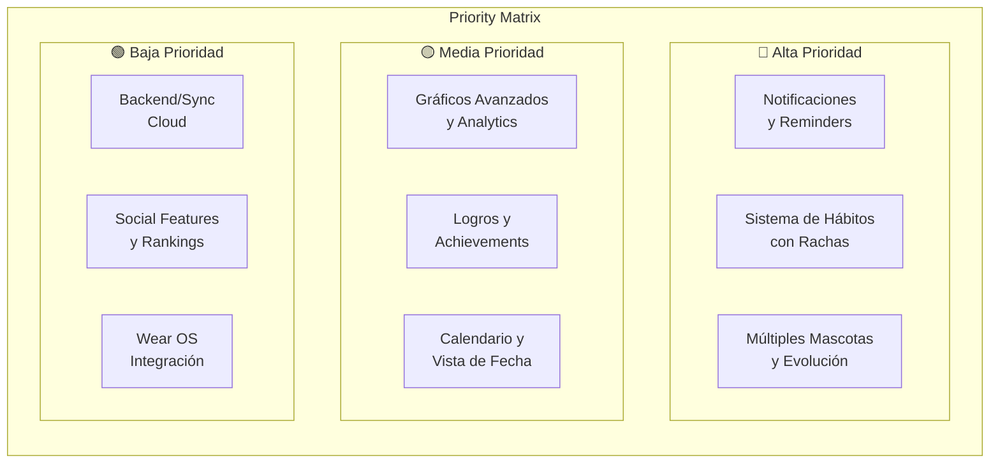

---

## Próximos Pasos Inmediatos

1. **Implementar notificaciones** (`flutter_local_notifications`)
2. **Extender modelo Task** con Schedule y Habit
3. **Crear Achievement system**
4. **Añadir Calendar view**
5. **Configurar Firebase** (auth + firestore)
6. **Implementar sync** offline-first

---

*Documento generado: Mayo 2026*
*Versión del proyecto: 1.0.0+1*